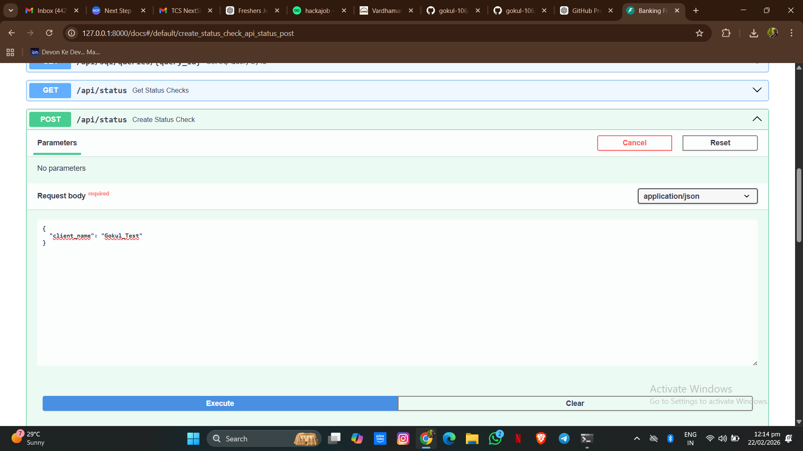
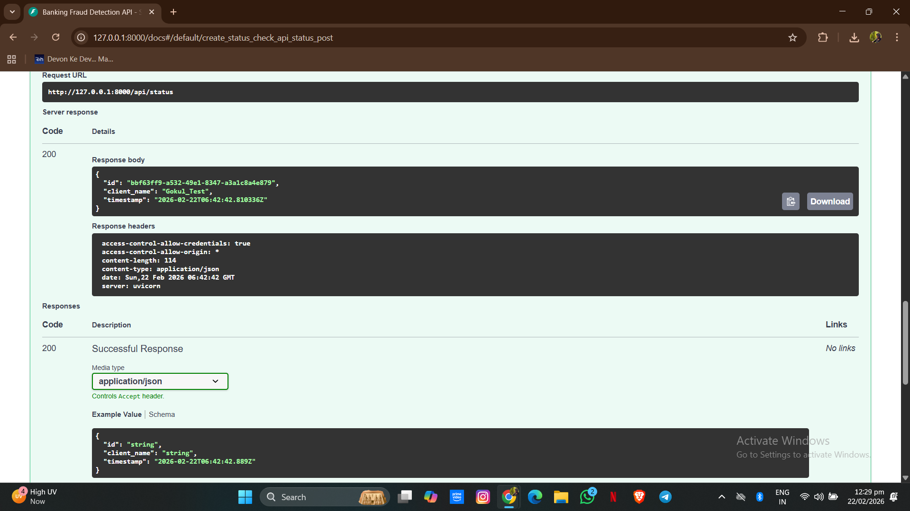

# Banking Fraud Detection Backend

## Overview
Backend-based banking fraud detection system built in Python to identify potentially fraudulent financial transactions. The system processes transaction data, performs preprocessing, applies fraud detection logic, and returns a classification result.
## Purpose
Designed to simulate how financial institutions automatically monitor transactions and flag suspicious activity for risk review.
## Key Features
* Transaction data preprocessing and validation
* Fraud classification logic for suspicious activity detection
* Automated backend prediction workflow
* Structured handling of financial transaction records
## Tech Stack
Python, data preprocessing, machine learning classification concepts.
## How to Run
Clone the repository
git clone https://github.com/gokul-106/Banking-fraud-backend.git
cd Banking-fraud-backend
Install required libraries
pip install fastapi uvicorn pandas numpy python-dotenv
Start the backend server
python -m uvicorn server:app --reload
Open in browser:
http://127.0.0.1:8000/docs
## Author
Gokul Krishna
https://github.com/gokul-106
## API Demo

### Request Example

### Response Example

